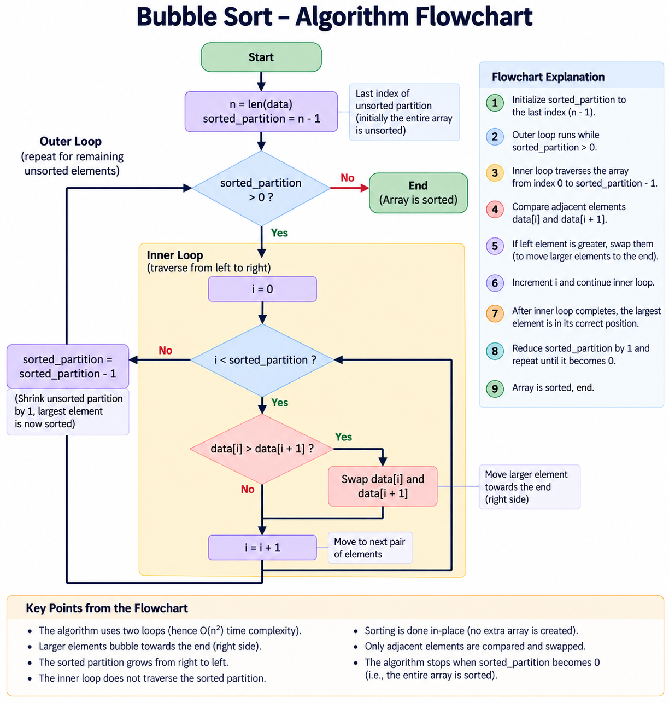

# Bubble Sort

> A simple comparison-based sorting algorithm that repeatedly compares adjacent elements and swaps them when they are in the wrong order.

| Field | Details |
|---|---|
| **Author** | Harshul Raina |
| **Version** | 1.0.0 |
| **Language** | Python |
| **Category** | Sorting Algorithm |
| **Algorithm** | Bubble Sort |
| **Order** | Ascending |
| **Last Updated** | 06 September 2026 |

---

## 1. Overview

Bubble Sort is one of the simplest sorting algorithms.

- Mainly used for **education** and learning sorting fundamentals.
- Usually one of the first sorting algorithms taught to students.
- Performance degrades quickly as the number of elements grows.
- It is a **comparison-based** sorting algorithm.
- It is an **in-place** sorting algorithm.
- Typical time complexity is **O(n²)**.

---

## 2. Example

Consider:

```text
Index:     0    1     2    3    4    5     6
Value:    20   35   -15    7   55    1   -22
```

At the beginning:

```python
unsorted_partition_index = 6
i = 0
```

- `unsorted_partition_index` marks the last index of the unsorted partition.
- `i` traverses the array from left to right.

---

## 3. Logical Partitioning

Bubble Sort logically divides the array into a **sorted partition** and an **unsorted partition**.

```text
Unsorted Partition                         Sorted Partition
        ↓                                         ↓

[20] [35] [-15] [7] [55] [1] [-22]       [   ]
```

These are logical partitions. We do **not** create separate arrays.

The sorted partition grows from **right to left**:

```text
First traversal:
[20] [-15] [7] [35] [1] [-22] | [55]

Second traversal:
[-15] [7] [20] [1] [-22] | [35] [55]
```

---

## 4. Code

```python
from typing import MutableSequence


def bubble_sort(data: MutableSequence) -> None:
    """
    Sort a mutable sequence in place using Bubble Sort.
    """

    for unsorted_partition_index in range(len(data) - 1, 0, -1):

        for i in range(unsorted_partition_index):

            if data[i] > data[i + 1]:
                data[i], data[i + 1] = data[i + 1], data[i]
```

---

### Bubble Sort Algorithm Flowchart



> **Image:** `docs/attachments/bubble_sort_flowchart.png`

## 5. Code Flow

The algorithm has two loops.

```text
                    bubble_sort(data)
                           │
                           ▼
              ┌─────────────────────────┐
              │ Outer loop              │
              │ Shrinks unsorted part   │
              └────────────┬────────────┘
                           │
                           ▼
              ┌─────────────────────────┐
              │ Inner loop              │
              │ Traverses unsorted part │
              └────────────┬────────────┘
                           │
                           ▼
              Compare data[i] and
                  data[i + 1]
                           │
                     ┌─────┴─────┐
                     │           │
              Left > Right    Left ≤ Right
                     │           │
                   Swap       No swap
                     │           │
                     └─────┬─────┘
                           ▼
                      Increment i
                           │
                           ▼
                 Continue traversal
                           │
                           ▼
              Shrink unsorted partition
                           │
                           ▼
                        Repeat
```

---

## 6. Outer Loop

```python
for unsorted_partition_index in range(len(data) - 1, 0, -1):
```

For an array of length `7`:

```text
unsorted_partition_index:

6 → 5 → 4 → 3 → 2 → 1
```

The outer loop controls the boundary of the unsorted partition.

After each complete traversal, the largest remaining unsorted value is placed at the end.

Therefore, the sorted partition grows from right to left.

```text
Start:
[20] [35] [-15] [7] [55] [1] [-22]
```

After the first traversal:

```text
[20] [-15] [7] [35] [1] [-22] | [55]
                                ↑       ↑
                            unsorted  sorted
```

After the second traversal:

```text
[-15] [7] [20] [1] [-22] | [35] [55]
                          ↑       ↑
                      unsorted  sorted
```

---

## 7. Inner Loop

```python
for i in range(unsorted_partition_index):
```

The inner loop traverses the unsorted partition from left to right.

For the first traversal:

```python
unsorted_partition_index = 6
```

So:

```python
range(6)
```

produces:

```text
0 → 1 → 2 → 3 → 4 → 5
```

Index `6` is not processed because it becomes part of the sorted partition after the first traversal.

---

## 8. Comparing Adjacent Elements

```python
if data[i] > data[i + 1]:
```

We compare neighboring elements:

```text
data[i]       data[i + 1]
   ↓               ↓

[20] [35] [-15] [7] [55] [1] [-22]
 ↑     ↑
 i    i+1
```

For ascending order:

```text
Left > Right
     ↓
   Swap
```

Example:

```text
35 > -15
```

Therefore:

```text
Before:
[20] [35] [-15] [7] [55] [1] [-22]

After:
[20] [-15] [35] [7] [55] [1] [-22]
```

---

## 9. Swapping Elements

The swap uses Python's tuple unpacking:

```python
data[i], data[i + 1] = data[i + 1], data[i]
```

This moves the larger value one position toward the right.

```text
Before:
[20] [35] [-15] [7] [55] [1] [-22]

                35 > -15
                     ↓
After:
[20] [-15] [35] [7] [55] [1] [-22]
```

Repeated swaps cause larger values to **bubble toward the end**.

---

## 10. First Traversal

Starting array:

```text
[20] [35] [-15] [7] [55] [1] [-22]
```

The comparisons are:

```text
20 > 35  ?  No
35 > -15 ?  Yes → swap
35 > 7   ?  Yes → swap
35 > 55  ?  No
55 > 1   ?  Yes → swap
55 > -22 ?  Yes → swap
```

After the traversal:

```text
[20] [-15] [7] [35] [1] [-22] [55]
```

`55` is now in its correct position.

```text
[20] [-15] [7] [35] [1] [-22] | [55]
```

Then the partition boundary moves:

```text
6 → 5
```

---

## 11. Second Traversal

Now:

```text
[20] [-15] [7] [35] [1] [-22] | [55]
```

Only the unsorted portion is processed.

Comparisons:

```text
20 > -15 ?  Yes
20 > 7    ?  Yes
20 > 35   ?  No
35 > 1    ?  Yes
35 > -22  ?  Yes
```

Result:

```text
[-15] [7] [20] [1] [-22] | [35] [55]
```

The boundary moves again:

```text
5 → 4
```

The remaining traversals follow exactly the same process.

---

## 12. Complete Algorithm Flow

```text
Start
  │
  ▼
Entire sequence is unsorted
  │
  ▼
Set unsorted partition to last index
  │
  ▼
Set i = 0
  │
  ▼
Compare data[i] with data[i + 1]
  │
  ├── Left > Right ──► Swap
  │
  └── Left ≤ Right ──► No swap
  │
  ▼
Increment i
  │
  ▼
End of unsorted partition?
  │
  ├── No ──► Continue
  │
  └── Yes
        │
        ▼
Largest unsorted value is sorted
        │
        ▼
Shrink unsorted partition
        │
        ▼
Repeat
        │
        ▼
Entire sequence sorted
```

Final result:

```text
[-22] [-15] [1] [7] [20] [35] [55]
```

---

## 13. In-Place Sorting

Bubble Sort modifies the original sequence.

It does not create another array containing the sorted values.

```text
Original:
[20] [35] [-15] [7] [55]
        │
        │ swap
        ▼
Same array:
[20] [-15] [35] [7] [55]
```

Only a few local variables are required.

Therefore:

```text
Auxiliary Space = O(1)
```

---

## 14. Mutable Sequences

Bubble Sort swaps elements in the original sequence, so the sequence must be **mutable**.

The function uses:

```python
from typing import MutableSequence
```

Examples of mutable sequences:

```text
list
array.array
bytearray
```

Immutable sequences such as:

```text
str
tuple
```

cannot be sorted in place because their elements cannot be modified.

---

## 15. Stability

The comparison is:

```python
if data[i] > data[i + 1]:
```

It uses **strictly greater than** rather than `>=`.

Therefore, equal elements are not swapped.

This makes this implementation **stable**.

```text
Before:
[A1: 5] [B: 3] [A2: 5]

After:
[B: 3] [A1: 5] [A2: 5]
```

`A1` remains before `A2`.

---

## 16. Time Complexity

Bubble Sort contains two nested loops:

```python
for unsorted_partition_index in range(...):

    for i in range(...):
```

A useful rule of thumb:

```text
One loop
   ↓
O(n)

Two nested loops
   ↓
O(n × n)
   ↓
O(n²)
```

The inner loop becomes shorter on each traversal because the sorted partition grows.

The comparisons are approximately:

```text
(n - 1) + (n - 2) + (n - 3) + ... + 1
```

Big O focuses on the general growth rate rather than the exact number of operations.

Therefore:

```text
Bubble Sort = O(n²)
```

### Complexity Table

| Case | Complexity |
|---|---:|
| Best Case* | `O(n)` |
| Average Case | `O(n²)` |
| Worst Case | `O(n²)` |
| Auxiliary Space | `O(1)` |

*The `O(n)` best case applies to the optimized version that stops when no swaps occur during a traversal.

---

## 17. Optimization

We can track whether any swap occurred during a traversal.

```python
from typing import MutableSequence


def bubble_sort(data: MutableSequence) -> None:
    """
    Sort a mutable sequence in place using optimized Bubble Sort.
    """

    for unsorted_partition_index in range(len(data) - 1, 0, -1):

        swapped = False

        for i in range(unsorted_partition_index):

            if data[i] > data[i + 1]:
                data[i], data[i + 1] = data[i + 1], data[i]
                swapped = True

        if not swapped:
            break
```

If no swap occurs:

```text
No swaps
   ↓
No elements are out of order
   ↓
Sequence is already sorted
   ↓
Stop
```

This improves the best case to:

```text
O(n)
```

while the average and worst cases remain:

```text
O(n²)
```

---

## 18. Final Code

```python
from typing import MutableSequence


def bubble_sort(data: MutableSequence) -> None:
    """
    Sort a mutable sequence in place using optimized Bubble Sort.
    """

    for unsorted_partition_index in range(len(data) - 1, 0, -1):

        swapped = False

        for i in range(unsorted_partition_index):

            if data[i] > data[i + 1]:
                data[i], data[i + 1] = data[i + 1], data[i]
                swapped = True

        if not swapped:
            break
```

### Code Flow in One View

```text
Outer loop
    │
    ├── unsorted_partition_index
    │       ↓
    │   6 → 5 → 4 → 3 → 2 → 1
    │
    └── Inner loop
            │
            ├── i = 0
            ├── Compare i and i + 1
            ├── Swap if left > right
            ├── Increment i
            └── Stop at partition boundary

After each traversal:
    ↓
Largest unsorted value reaches the right
    ↓
Sorted partition grows
    ↓
Repeat
    ↓
Sequence sorted
```

---

## 19. Key Points

- Bubble Sort compares **adjacent elements**.
- If the left element is greater than the right element, they are swapped.
- Larger values bubble toward the end for ascending-order sorting.
- The sorted partition grows from **right to left** in this implementation.
- The sorted and unsorted partitions are logical; no separate arrays are created.
- Bubble Sort is an **in-place** sorting algorithm.
- Auxiliary space complexity is `O(1)`.
- Basic Bubble Sort has `O(n²)` time complexity.
- The optimized version has an `O(n)` best case.
- Average and worst cases remain `O(n²)`.
- The `>` comparison keeps this implementation stable.
- Bubble Sort requires a **mutable sequence** because it modifies elements in place.
- It is primarily useful for learning sorting fundamentals rather than large-scale sorting.
